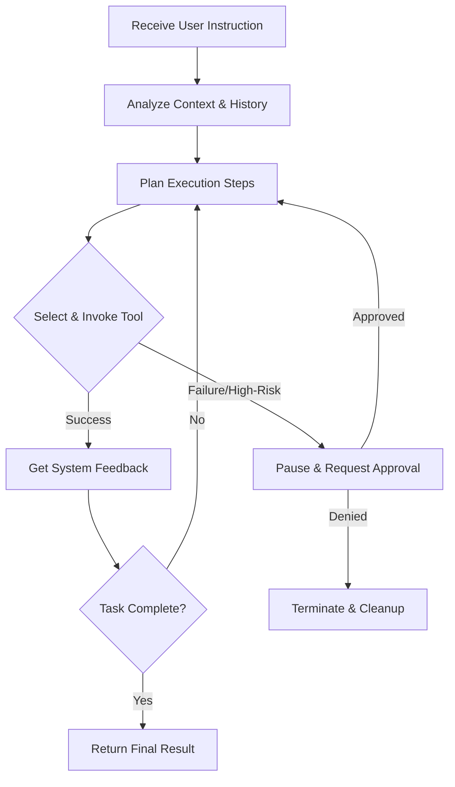

## Introduction

Modern LLM chatboxes can answer plenty of questions, but when it comes to real work—running scripts, tweaking configs, navigating web pages, scraping data on a schedule, or routing notifications across platforms—text alone isn't enough. Hermes Agent bridges this gap. It's not just a chatbot; it's an automated execution framework that turns model reasoning into tangible actions. The model handles judgment and planning, while the framework gets the job done.

## Core Runtime Logic

Hermes operates on a straightforward loop: upon receiving a task, the model inspects the environment, checks historical context, maps out steps, and then invokes tools to execute them. Whether it's terminal commands, browser interactions, or file I/O, every step returns real system feedback. If execution succeeds, it moves forward. If it fails or hits a high-risk operation requiring human approval, it pauses and waits.

The execution flow can be summarized as follows:

This loop runs inside a controlled sandbox, preserving the model's flexibility while preventing system-level damage from hallucinations or unintended side effects.

## Core Capabilities Breakdown

### 1. System Interaction & Sandboxed Execution
Terminal and code execution are foundational. `terminal` supports foreground blocking calls and background persistent processes, capturing stdout, monitoring exit codes, and triggering callbacks on specific log patterns. `execute_code` provides an isolated Python environment with built-in file I/O, regex search, and code patching utilities. Batch replacements, build pipelines, and data cleaning are routine operations.

### 2. Browser Automation
Many ops and data tasks depend on the web. The built-in browser control chain supports everything from page navigation and form filling to structured data extraction and screenshot analysis, including console error monitoring. It doesn't just "read" the DOM; it interacts with it like a human. Paired with vision APIs, it handles complex dynamic layouts or CAPTCHAs effortlessly.

### 3. Persistent Memory & Context Retrieval
Traditional AI forgets everything after a session. Hermes uses local key-value storage for cross-session state persistence. The `memory` tool logs environment configs, user preferences, and historical troubleshooting notes, injecting them into future contexts. Combined with `session_search` (full-text session retrieval), the model can proactively look up past records when asked "how did we fix that last time?", eliminating repetitive debugging.

### 4. Task Decomposition & Parallel Execution
For complex workloads, the main agent automatically splits tasks and delegates them to multiple sub-agents. Each sub-agent runs in an isolated terminal session, toolset, and working directory. Results are aggregated upon completion. The framework controls concurrency depth, boosting throughput without blowing up context windows.

### 5. Scheduled Jobs & Multi-Channel Delivery
Using the built-in `cronjob` module, tasks can be scheduled via standard cron expressions. Data collection, report generation, and status sync run on autopilot. Upon completion, results are automatically routed to WeChat, Telegram, Discord, or local storage. Jobs are stateless; prompts just need to be self-contained, requiring zero human supervision.

## The Skills System

To make automation robust, Hermes introduces a "Skills" mechanism. Developers can codify common workflows—like GitHub releases, data pipelines, or deployment steps—into structured Markdown guides. When a task arrives, the model automatically matches and loads the relevant skill, following the prescribed steps and drastically reducing context-heavy reasoning.

Crucially, skill files are "alive." If execution reveals an outdated step or uncovers a pitfall not documented in the guide, the model directly calls the management tool to patch the skill file. Documentation and actual practice stay in sync, eliminating manual maintenance overhead.

## Security & Boundaries

Uncontrolled automation is dangerous. Hermes enforces hard engineering constraints:
- **Credential Isolation**: Tokens and environment variables are injected via local files and strictly masked during execution. Logs never expose sensitive fields.
- **Operation Approval**: High-risk commands (e.g., force pushes, resource deletion, system overwrites) trigger mandatory interception. The model cannot bypass this.
- **Resource Limits**: All commands and scripts have timeout and memory caps. Background processes support lifecycle tracking. If a job hangs or spirals, it's terminated automatically, leaving no zombie processes.

The design principle is clear: it doesn't take risks on your behalf. It only handles the repetitive, tedious, cross-system coordination work that drains engineering time.

## Conclusion

Hermes Agent's positioning is unambiguous. It doesn't try to replace human judgment; it offloads standardized workflows to machines. Paired with clear instructions, a reliable skill library, and reasonable permission boundaries, it delivers stable automation across daily development, ops monitoring, and content aggregation. You collect the results. It handles the rest.

> **Awesome AI View:** The next phase for LLMs isn't "better conversation," it's "better execution." Hermes packages tool invocation, state management, and sandbox isolation into out-of-the-box infrastructure, bridging the last mile from "chat" to "deployment." For developers and ops teams, this means freeing up bandwidth from repetitive cross-system operations to focus on architecture and core business logic. The engineering maturity of Agent frameworks will directly dictate AI's penetration rate in production environments.
