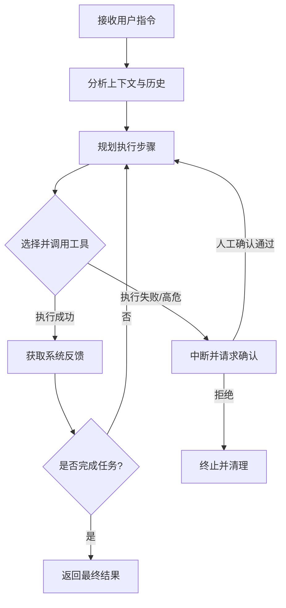

## 引言

现在的 LLM 聊天框已经能回答不少问题，但一旦涉及到实际工作——跑脚本、改配置、翻网页、定时抓数据、跨平台发通知——光靠“对话”就不够用了。Hermes Agent 就是为了解决这个断层出现的。它不只是一个聊天机器人，而是一个能把大模型的想法落地的自动化执行框架。模型负责判断和规划，框架负责把事办完。

## 核心运行逻辑

Hermes 的底层逻辑很直接：拿到任务后，模型会先看环境、查历史、理清步骤，然后调用工具去执行。终端命令、浏览器操作、文件读写，每一步都会拿到真实的系统反馈。执行顺利就继续下一步；如果报错，或者遇到需要人工确认的高危操作，它会停下来等待审批。

整个执行链路可以概括为以下循环：

这个循环在受控的沙盒环境中运行，既保留了模型的灵活性，又避免了“幻觉”导致的系统级破坏。

## 核心能力拆解

### 1. 系统交互与沙盒执行
终端和代码执行是它的基本功。`terminal` 支持前台阻塞调用和后台常驻进程，能捕获标准输出、监控退出码、按特定日志触发回调。`execute_code` 提供隔离的 Python 运行环境，内置文件读写、正则搜索、代码补丁等工具。批量替换、跑构建流程、数据清洗，都是常规操作。

### 2. 浏览器自动化
很多运维和采集工作离不开网页。内置的浏览器控制链路支持从打开页面、填表点击，到提取结构化数据、截图分析，甚至监控控制台报错。它不只是“读取”页面，而是能像人一样去交互。配合视觉识别接口，处理复杂动态布局或验证码也很顺手。

### 3. 持久记忆与上下文检索
传统 AI 聊完就忘，Hermes 通过本地键值存储实现了跨会话状态保持。`memory` 工具会把环境配置、用户偏好、历史踩坑记录记下来，下次直接注入上下文。配合 `session_search` 全文检索，模型在遇到“上次那个问题是怎么处理的”这类指令时，能主动回溯过往记录，避免重复排错。

### 4. 任务拆解与并行
遇到复杂任务，主代理会自动拆解并分配给多个子代理。每个子代理在独立的终端会话、工具集和工作目录中运行，互不干扰。跑完后结果自动汇总。框架支持控制并发深度，既能提升吞吐量，又不会撑爆上下文窗口。

### 5. 定时调度与多端推送
通过内置的 `cronjob` 模块，可以设定标准 Cron 表达式让任务定时运行。采集数据、生成报表、同步状态，跑完后自动将结果推送到微信、Telegram、Discord 或本地文件。调度任务是无状态运行的，Prompt 只需自包含完整上下文即可，无需人工盯守。

## 技能系统（Skills）

为了让自动化更稳定，Hermes 引入了“技能”机制。开发者可以将常用的工作流——比如 GitHub 发版、数据清洗、部署流程——写成结构化的 Markdown 指南。模型接到任务时会自动匹配并加载对应技能，照着步骤执行，大幅减少上下文推理开销。

更实用的是，技能文件是“活”的。如果执行过程中发现某一步骤过时，或者遇到了指南没写的坑，模型会直接调用管理工具更新对应的技能文件。文档和实际操作始终保持一致，无需人工反复维护。

## 安全与边界

自动化最怕失控。Hermes 在工程层面做了硬约束：
- **凭证隔离**：Token 与环境变量通过本地文件注入，执行过程中严格屏蔽，日志绝不打印敏感字段。
- **操作审批**：高危命令（如强制推送、资源删除、系统覆盖）会触发强制拦截，模型无法自行绕过。
- **资源限制**：所有命令与脚本均设超时与内存上限，后台进程支持生命周期追踪，跑飞了自动掐断，不留僵尸进程。

它的设计原则很明确：不替你冒险，只替你干那些重复、繁琐、需要跨系统协调的脏活累活。

## 结语

Hermes Agent 的定位很清晰。它不试图替代人的判断，而是把标准化的工作流交给机器去跑。配上清晰的指令、靠谱的技能库和合理的权限边界，它就能在日常开发、运维巡检、资讯聚合这些场景里，稳定地替你干活。你只管收结果，剩下的交给它。

> **Awesome AI 观点：** LLM 的下一阶段不是“更会聊天”，而是“更能干活”。Hermes 把工具调用、状态管理和沙盒隔离做成了开箱即用的基础设施，补齐了从“对话”到“落地”的最后一公里。对于开发者和运维团队来说，这意味着可以把精力从重复的跨系统操作中抽出来，专注于架构与核心业务逻辑。Agent 框架的工程化成熟度，将直接决定 AI 在生产环境的渗透率。
